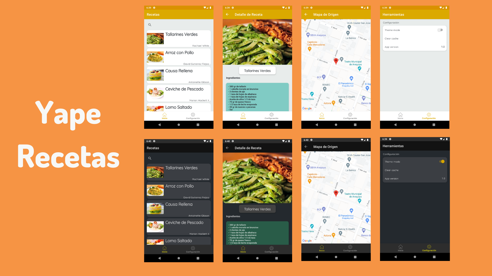

# Recetas Yape

- [Challenge](https://drive.google.com/file/d/1bdWs-nwdLCCaRn5k-8UbJcLRx5MNewUo/view?usp=share_link) - Challenge Instructions

The Recetas Yape - App consumes a [Recipes API](https://63e87ffa5f3e35d898f15901.mockapi.io/api/v1/recipes), api created using [mock api.io](https://mockapi.io/). This app allows to display Recipes which has been built with clean architecture principles, Repository Pattern, and MVVM pattern as well as Component Architecture, respecting SOLID principles.
Allows us to store API responses in a local database, allowing us to work offline with this data (cache).

This app shows the usage of the new Navigation Architecture Component in collaboration with the Bottom Navigation view with separate back stack history for each tab.

**App features:**
- Food Recipes
- Detail of recipes
- Show Food origin on map
- Light/ Dark theme.

## Screenshots

## Architecture
It uses concepts from Antonio Leiva's clean architecture approach [Clean Architecture](https://antonioleiva.com/clean-architecture-android/). 
For the highest level layer we consider MVVM which allows us to cleanly separate the presentation and business logic of an application from its user interface (UI).

Using this combination of MVVM + Clean architecture enhances the separation of concerns with modular approach.

* Better separation of concerns. Each module has a clear API., Feature related classes life in different modules and can't be referenced without explicit module dependency.
* Features can be developed in parallel eg. by different teams
* Each feature can be developed in isolation, independently from other features
* faster compile time

## Dessign Patterns
- Repository:
  Implementing the repository pattern allows us to respect the SOLID principles, mainly the Dependency Inversion principle. Fulfilling the objective of seeking to depend on abstractions and not on details, relying on a modular structure.
- Observer:
  To define a subscription mechanism to notify multiple objects of any event occurring on the object they are observing. Allowing to implement MVVM to communicate view models with views.
- DAO:
  It is used to separate the data persistence logic into a separate layer. In this project, it is applied at the cache module level.

## Modules:
* **app**  
  - MVVM with ViewModels exposing LiveData that the UI consume.
  - It uses all the components and classes releated to Android Framework. It gets the data and shows on UI. (Android module that **access all the modules**)
* **data** - The data layer implements the repository interface that the domain layer defines. This layer provide a single source of truth for data. (Kotlin module that **can only access domain module**)
* **remote** - Handles data interacting with the network. (**can only access data module**)
* **cache** - Handles data interacting with the local storing (Room DB). (**can only access data module**)
* **domain** - The domain layer contains the UseCases that encapsulate a single and very specific task that can be performed. This task is part of the business logic of the application. (Kotlin module that **cannot access any other module**)

## Tech stack - Library:
- [Kotlin](https://kotlinlang.org/)
- [Coroutines](https://github.com/Kotlin/kotlinx.coroutines) - A coroutine is a concurrency design pattern that you can use on Android to simplify code that executes asynchronously
- [Flow](https://kotlin.github.io/kotlinx.coroutines/kotlinx-coroutines-core/kotlinx.coroutines.flow/) - Flow is used to pass (send) a stream of data that can be computed asynchronously
- [Dagger-Hilt](https://developer.android.com/training/dependency-injection/hilt-android) - for dependency injection.
- [Kotlin-DSL](https://docs.gradle.org/current/userguide/kotlin_dsl.html) - Used to handle gradle dependencies and config versions
- JetPack
    - [LiveData](https://developer.android.com/topic/libraries/architecture/livedata) - For reactive style programming (from VM to UI).
    - [Lifecycle](https://developer.android.com/jetpack/androidx/releases/lifecycle) - Used get lifecyle event of an activity or fragment and performs some action in response to change
    - [ViewModel](https://developer.android.com/topic/libraries/architecture/viewmodel) - Stores UI-related data that isn't destroyed on UI changes.
    - [Room](https://developer.android.com/topic/libraries/architecture/room) - Used to create room db and store the data.
    - [Navigation](https://developer.android.com/guide/navigation/navigation-getting-started) - Used to navigate between fragments
    - [Data Binding](https://developer.android.com/topic/libraries/data-binding) - Used to bind UI components in your XML layouts.
- [Material-Components](https://github.com/material-components/material-components-android) - Material design components like ripple animation, cardView.
- [Retrofit](https://github.com/square/retrofit) - Used for REST api communication.
- [OkHttp](http://square.github.io/okhttp/) - HTTP client that's efficient by default: HTTP/2 support allows all requests to the same host to share a socket
- [Gson](https://github.com/square/retrofit/tree/master/retrofit-converters/gson) - Used to convert Java Objects into their JSON representation and vice versa.
- [Timber](https://github.com/JakeWharton/timber) - Used for logging.
- [Glide](https://bumptech.github.io/glide/) - Glide is a fast and efficient image loading library for Android
- [Lottie](https://airbnb.io/lottie/) - Lottie is a library that allows you to real-time animations
- Test
  - [Mockk](https://github.com/mockk/mockk) - Allows unit testing, which avoids the need for external dependencies
  - [androidx-core](https://androidx.tech/artifacts/arch.core/core-testing/) - Allows working with LiveData in order to create dispatcher

## Reference repository
This repository code is mostly inspired by [Android-Clean-Architecture-Boilerplate](https://github.com/bufferapp/android-clean-architecture-boilerplate).

## Find this repository useful? :heart:
- Github -> [ https://github.com/DavidVegaC/Challenge-Yape.git ] 
